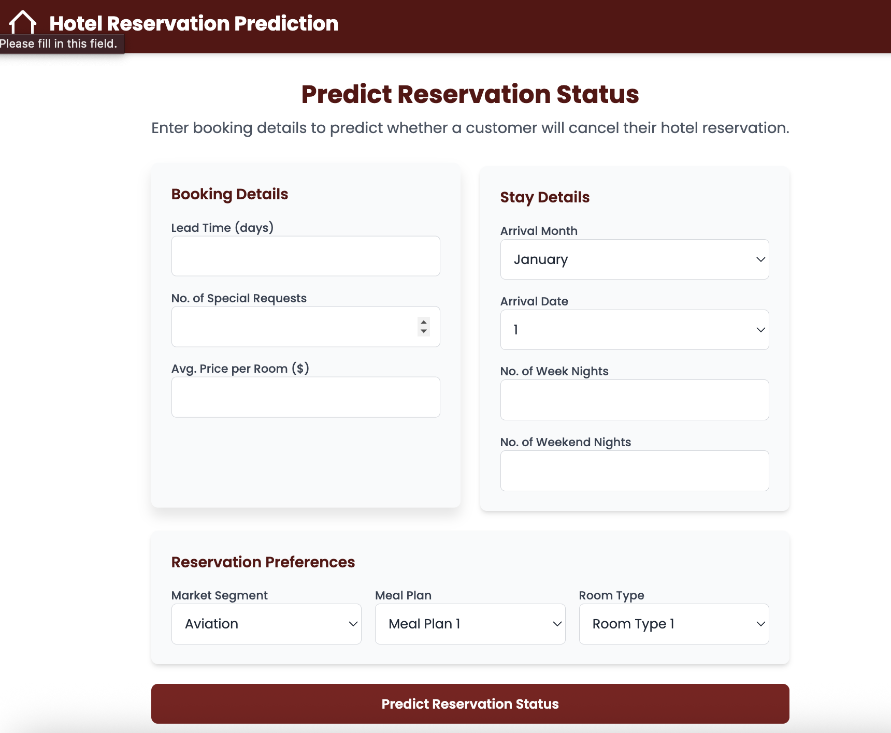
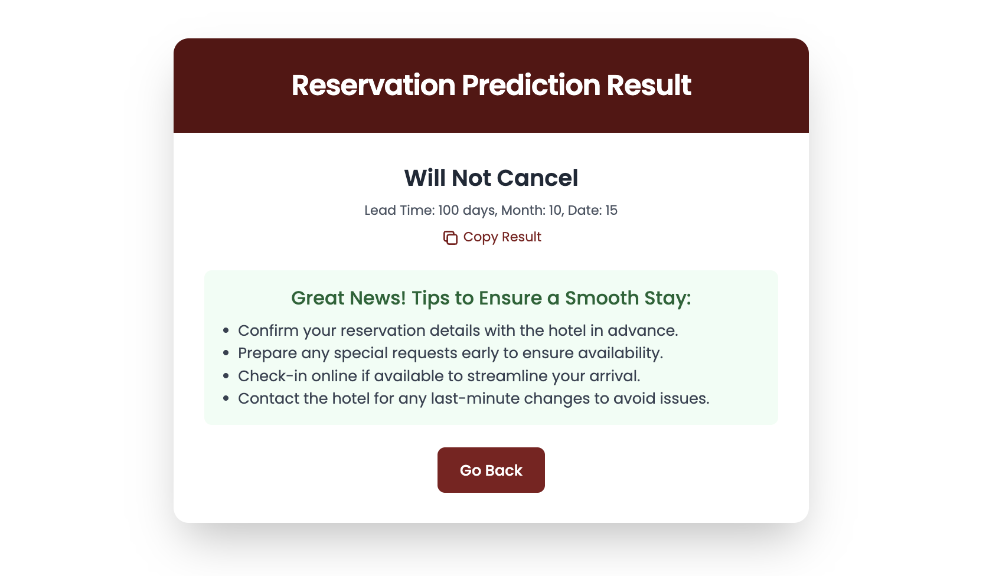
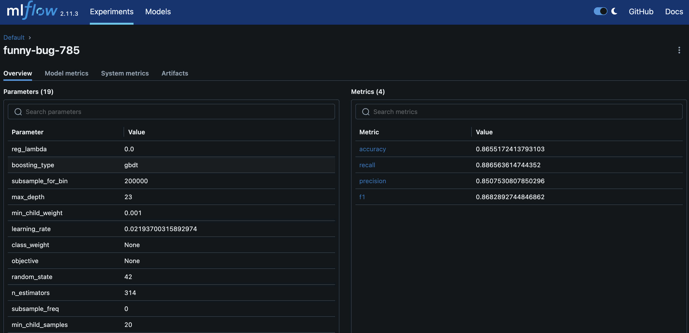
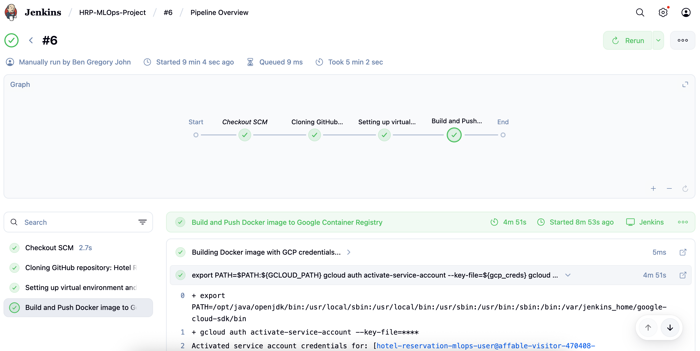

# Hotel Reservation Prediction

Hotel reservation systems are a core part of the hospitality industry, where predicting whether a reservation will be honored (i.e., not canceled) is crucial for **revenue management, customer satisfaction, and fraud prevention**.  

This project is an **end-to-end MLOps pipeline** that predicts hotel reservation outcomes using machine learning. It integrates **data engineering, model training, MLflow experiment tracking, CI/CD automation with Jenkins, and cloud deployment on GCP** to simulate a production-grade ML system.

## Problem Statement
Hotels face significant challenges due to last-minute cancellations and no-shows. This leads to:

- 💸 **Revenue loss**

- 🏚️ **Inventory mismanagement**

- 😞 **Customer dissatisfaction**

**Objective:** Build a machine learning model that predicts whether a reservation will be **honored or canceled**, enabling hotels to make informed decisions in advance.

---

##  Use Cases
1. **Fraud Detection**: Identify suspicious or fraudulent bookings that are likely to be canceled.
   
2. **Revenue Management**: Improve dynamic pricing strategies by predicting booking reliability.
   
3. **Inventory Optimization**  
   - Manage room availability and prevent overbooking/underbooking.
   
4. **Customer Relationship Management (CRM)**: Detect at-risk customers and provide incentives to reduce cancellations.
   
5. **Operational Efficiency**: Help hotels plan staff and resources based on reliable reservations.

---

## Screenshots

- **Prediction Home Page**


- **Prediction Result Screen**


- **MLFlow Artifacts**


- **¸Jenkins CI-CD Pipelines**

---

## Tech Stack

- Programming & ML: `Python, Scikit-learn, Pandas, NumPy`

- Experiment Tracking: `MLflow` (model tracking, registry, deployment)

- Pipeline Orchestration: `Jenkins` (CI/CD automation)

- Containerization: `GCR` (Docker)

- Cloud Deployment: `Google Cloud Platform`

- Version Control: `Git, GitHub`

- Monitoring & Logging: `MLflow, GCP Monitoring`

---

## Project Workflow

### 1. Data Ingestion
- Source: Hotel reservation datasets (structured CSV/Parquet).  

- Steps:  
  - Load raw data from Google Cloud Bucket.  
  - Store versioned datasets in `artifacts/data_ingestion/` for reproducibility.  

### 2. Data Processing

- Data cleaning: handle missing values, duplicates, and inconsistent entries.  

- Feature engineering:  
  - Date-based features such as lead time and stay duration.  
  - Categorical encoding for hotel type, customer type, and deposit type.  
  - Outlier detection and handling to improve model robustness.  

- Dataset splitting into training and testing sets.  

### 3. Model Training

- Algorithms used:  
  - **Random Forest**: A robust ensemble method for handling structured data and reducing overfitting.  
  - **LightGBM**: A gradient boosting framework optimized for speed and efficiency, suitable for large datasets.  

- Hyperparameter tuning performed with **RandomizedSearchCV** for optimal performance.  

- Evaluation metrics tracked: Accuracy, Precision, Recall, and F1-Score.  

### 4. MLflow Tracking

- Log key parameters, metrics, artifacts (confusion matrix, feature importance), and models.  

- Register the best-performing model in the `MLflow Model Registry`.  

- Compare multiple experiment runs to select a production-ready model.  

### 5. Model Evaluation

- Evaluate final model performance on the test set.  

- Emphasis on business-critical metrics:  
  - False negatives (predicting honored but actually canceled → major revenue risk).  
  - Balancing precision and recall to reduce both financial loss and customer dissatisfaction.  


---

## Docker and Jenkins Setup

### **Step 1: Setup Jenkins Container**

1. **Build Jenkins Docker Image**
   
```bash
   cd jenkins
   docker build -t jenkins-hrp .
   docker images
```
2. **Run Jenkins Container**
  
```bash
  docker run -d --name jenkins-hrp \
    --privileged \
    -p 8080:8080 -p 50000:50000 \
    -v //var/run/docker.sock:/var/run/docker.sock \
    -v jenkins_home:/var/jenkins_home \
    jenkins-hrp
```
5. **Verify Jenkins Container**

```bash
docker ps
docker logs jenkins-hrp
```

### **Step 2: Access Jenkins and Complete Setup**

1. Open [localhost:8080](localhost:8080) in a browser.

2. Paste the password copied from logs.

3. Install suggested plugins.

4. Create your Jenkins user credentials and complete the setup.

### **Step 3: Install Python and Packages in Jenkins Container**

1. **Access Jenkins container terminal:**
```bash
docker exec -u root -it jenkins-hrp bash
```

2. **Install Python 3, pip, and venv:**
```bash
apt update -y
apt install -y python3 python3-pip python3-venv
ln -s /usr/bin/python3 /usr/bin/python
exit
```

3. **Restart Jenkins container:**
```bash
docker restart jenkins-hrp
```

### **Step 4: Build and Run Project Docker Image**

1. **Build project Docker image:**

```bash
docker build -t your_project_image .
```

2. **Run the project container:**
```bash
docker run -d -p 5000:5000 your_project_image
```

### **Step 5: Install Google Cloud CLI in Jenkins Container**

```bash
docker exec -u root -it jenkins-hrp bash

apt-get update -y

apt-get install -y curl apt-transport-https ca-certificates gnupg

curl https://packages.cloud.google.com/apt/doc/apt-key.gpg | apt-key add -

echo "deb https://packages.cloud.google.com/apt cloud-sdk main" | tee -a /etc/apt/sources.list.d/google-cloud-sdk.list

apt-get update && apt-get install -y google-cloud-sdk

gcloud --version

exit
```

### **Step 6: Grant Docker Permissions to Jenkins User**

```bash
docker exec -u root -it jenkins-hrp bash

groupadd docker

usermod -aG docker jenkins

usermod -aG root jenkins

exit
```

## Contributors

[Ben Gregory John](https://www.linkedin.com/in/bengj10/) – ML Engineer & MLOps Developer | [GitHub](https://github.com/BenGJ10) 